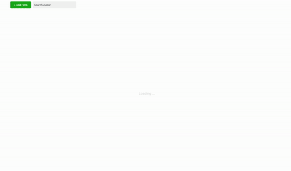
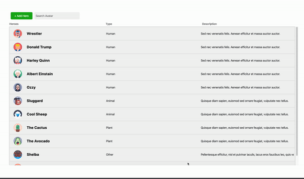
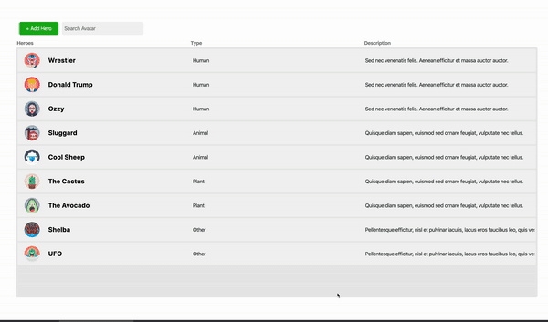
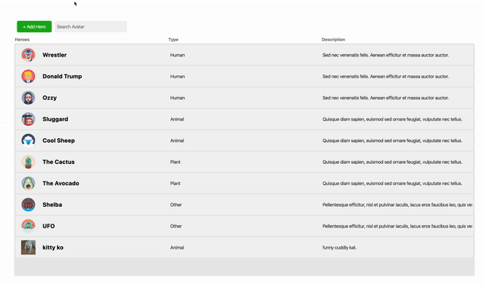

<!-- TABLE OF CONTENTS -->

An application for managing avatars.

## Table of Contents

- [Table of Contents](#table-of-contents)
- [Built With](#built-with)
- [Getting Started](#getting-started)
  - [Initial setup](#initial-setup)
  - [Running the project](#running-the-project)
  - [View Hero](#view-hero)
  - [Delete Hero](#delete-hero)
  - [Add Hero](#add-hero)
  - [Search Hero](#search-hero)

## Built With

- [Prisma](https://www.prisma.io/)
- [Node.js](https://node.js.org/)
- [Docker](https://www.docker.com/)
- [React.js](https://reactjs.org/)
<!-- GETTING STARTED -->

## Getting Started

Before you start, make sure you have all these packages installed. 
 - Prisma
 - Node.js
 - Docker
 - React.js
 - [ This link should get you sorted!](https://github.com/netguru/heroes-api/blob/master/README.md)

### Initial setup

   * Navigate to the directory of the application.
   * Run `npm install` to install all dependencies.
   * Run `npm run` to start the application on localhost on port 300x.
   * Run `npm test` to run tests.

This should get you started with the application. 

### Running the project

The initial loading screen.

### View Hero

### Delete Hero

### Add Hero

### Search Hero
